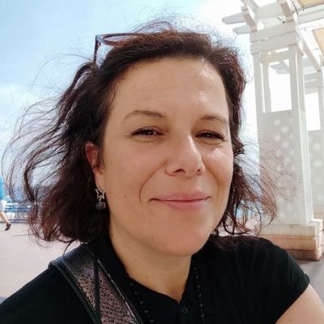

## Programme

<table>
  <thead>
    <tr>
      <th></th>
      <th></th>
    </tr>
  </thead>

  <tbody>
    <tr>
      <td>14:45 - 14:50</td>
      <td>
        Présentation de l'Atelier CODA - annonce Chronotopies
        <ul>
          <li>Baptiste Caramiaux, ISIR</li>
          <li>Frédérique Bevilacqua, IRCAM, STMS</li>
          <li>Genoveva Vargas-Solar, LIRIS</li>
        </ul>
      </td>
    </tr>
    <tr>
      <td>14:50 - 15:20</td>
      <td>
        Keynote en ligne
        <ul>
          <li> <a href="#alexandre-gefen">Alexander Grefen</a>  
          Sorbonne Nouvelle / THALIM, CNRS 
          </li>
        </ul>        
      </td>
    </tr>
    <tr>
      <td>15:20 - 15:50</td>
      <td>
        Keynote présentiel
        <ul>
          <li><a href="#fanny-georges">Fanny Georges</a>  
          Sorbonne Nouvelle / IRMECCEN
          </li>
        </ul>        
      </td>
    </tr>
    <tr>
      <td>15:50 - 16:45</td>
      <td>
        Activité collective
        <ul>
          <li>Animation: Baptiste Caramiaux, ISIR</li>
        </ul>        
      </td>
    </tr>
  </tbody>
</table>

## Biographies

### Alexandre Gefen

[Alexandre Gefen](https://www.fabula.org/annuaire/2-alexandre-gefen/) est directeur de recherche CNRS au sein de l’unité Théorie et histoire des arts et des littératures de la modernité (UMR7172, THALIM, CNRS / Université Sorbonne Nouvelle – Paris 3) et historien des idées et de la littérature. Il est l’auteur de nombreux articles et essais portant notamment sur la culture, la littérature contemporaine et la théorie littéraire. Dernières parutions : avec Sandra Laugier, *Le Pouvoir des liens faibles*, CNRS éditions, 2002. *Territoires de la non-fiction*, Brill, 2020. Avec Olivier Bessard-Banquy et Sylvie Ducas, *Best-sellers. L’industrie du succès*, Armand Colin, 2021. *L’idée de littérature. De l’art pour l’art aux écritures d’intervention*, Corti, 2021.

Fondateur de [Fabula.org](https://www.fabula.org), il a été l’un des pionniers des Humanités Numériques en France. Il a découvert les usages de l’IA pour la recherche (vecteurs de mots, topic modelling) au Literary Lab de Stanford dans le cadre du projet « Pour une histoire empirique de la littérature », *Transatlantic program for collaborative work in the field of digital humanities*, dont il a été co-porteur avec Franco Moretti (FMSH Paris – Fondation Mellon).

Par ailleurs, Directeur Adjoint Scientifique de l’Institut des Sciences Humaines et Sociales du CNRS depuis 2017, il a en charge les priorités « Humanités Numériques » et « Intelligence Artificielle ». Il a notamment représenté les SHS dans le Forum mondial sur l’IA pour l’humanité organisé en 2019 et a coordonné avec Jérôme Lang l’appel à financement de la MITI du CNRS « Enjeux scientifiques et sociaux de l’intelligence artificielle » (2020).

Après un programme de recherche consacré aux fictions de l’Intelligence Artificielle ([ia-fictions.net](https://ia-fictions.net)), il est porteur principal (PI) du projet ANR « CulturIA », pour une histoire culturelle de l’IA.

---- 

### Fanny Georges 

[Fanny Georges](https://fannygeorges.wordpress.com/2023/12/27/fanny-georges/) est maître de conférences habilitée à diriger des recherches en sciences de l’Information et de la communication (SIC) à la Sorbonne Nouvelle, Institut de la Communication et des médias/UFR Arts & Médias, IRMECCEN (EA1484). Elle travaille sur les mythes sociotechnologiques de l’existence (identité numérique, mort numérique, immortalité numérique) dans une approche sociologique et sémiologique des traces numériques.

A l’UFR Arts & Médias/Institut de la Communication et des Médias de la Sorbonne Nouvelle. Elle a principalement travaillé sur la création de soi, l’identité et la relation à l’au-delà.

Elle s’intéresse aux aspects éthiques de l’activité d’enquête en sciences sociales. Depuis 2019, elle est vice-présidente du Comité d’Ethique de la Recherche de l’Université Sorbonne Nouvelle et membre du GER GENIC (Groupe sur l’Éthique et le Numérique en Information-Communication) de la Société Française des Sciences de l’Information et de la Communication.

Elle a soutenu mon Habilitation à Diriger des recherches le 13 février 2023 sur la construction sociale des mythes sociotechnologiques, considérant en particulier la responsabilité énonciative de la recherche en sciences humaines et sociales (et des SIC) dans la légitimation de ces mythes arrimés aux idéologies de l’innovation dans la culture scientifique.

